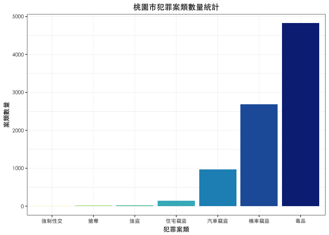
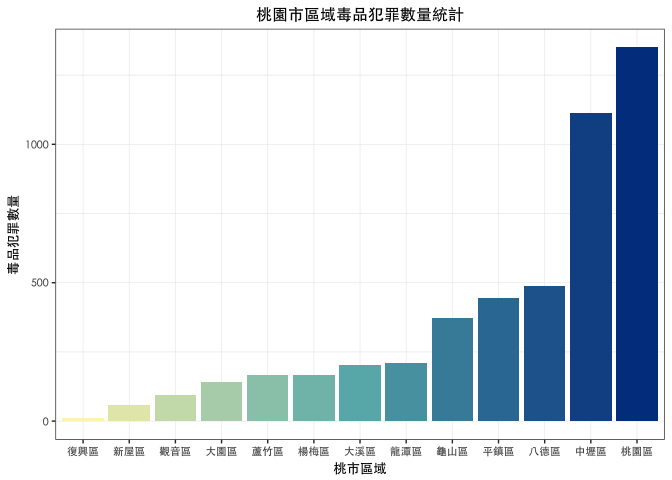
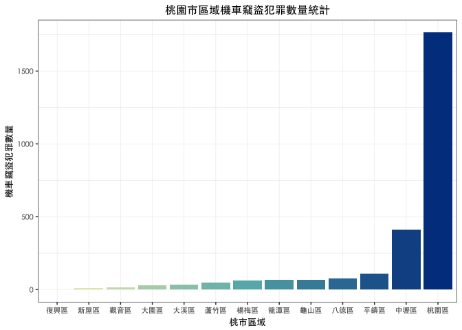
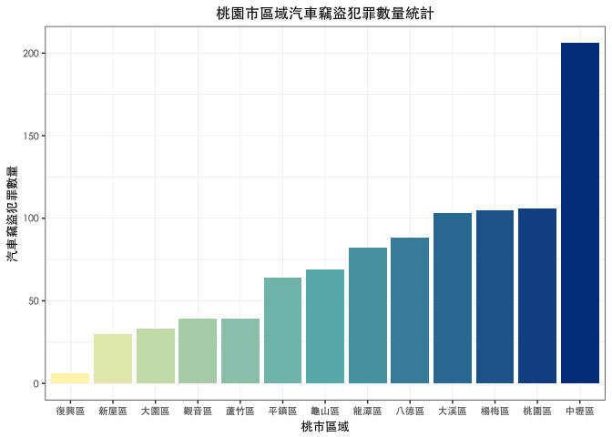
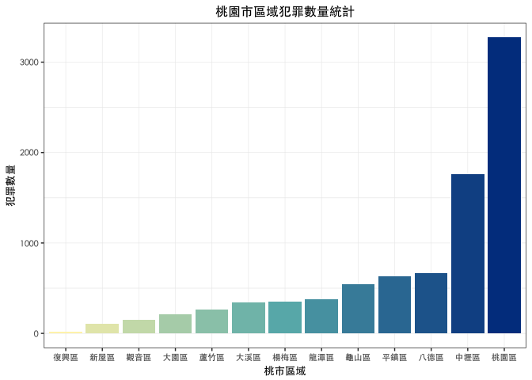
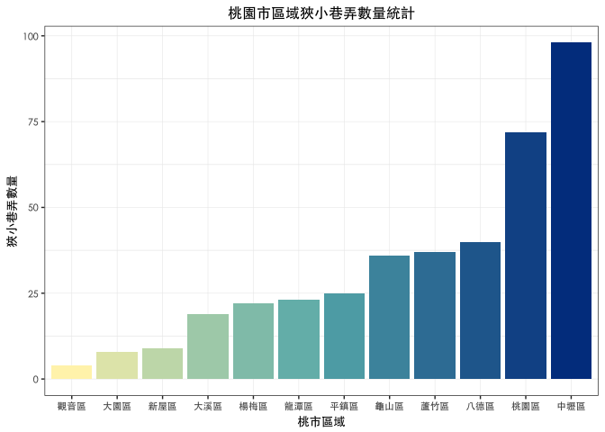

報告主題：居安思維-桃園市
================

組員姓名：游思亭

### 資料介紹

#### 1. 犯罪資料

來源：<http://data.gov.tw/node/14200>

格式：.CSV

資料描述：提供毒品、強盜、搶奪、住宅盜竊、汽車竊盜、機車竊盜、強制性交等7案類犯罪發生資料。

欄位：案類、發生日期、發生地點（鄉、鎮、市、區

#### 2. 桃園市狹小巷弄列管清冊

來源：<http://data.tycg.gov.tw/opendata/datalist/datasetMeta?oid=65c58683-220f-4075-a555-f80c7e580e5e>

格式：.CSV

資料描述：桃園市政府消防局搶救不易地區-狹小巷弄列管清冊，總計392處

欄位：序號、行政區、狹小巷弄地址

### 分析議題

#### 1. 議題背景 :

禮運大同篇：「....是故謀閉而不興，盜竊亂賊而不作，故外戶而不閉，是謂『大同』。」在每個人心中都有個小烏托邦。然

而，近幾年來卻發生了許多社會事件，導致普羅大眾人心惶惶。

#### 2. 議題動機 :

從古至今人們即在追求居安的生活品質，不論老少都需要一個安全穩定居住品質。因此，想要了解桃園市的優質居住區域，藉

由犯罪資料來分析出較適合的居住空間。

#### 3. 議題假設：

每個人都是桃園人，每個人都想在桃園地區找到較安全的行政區來居住。並參考桃園市自變更為直轄市後的分區發展願景

(出處：<https://www.moneydj.com/Topics/taoyuan/>)。

#### 4. 資料處理 :

・犯罪資料・

首先將每季犯罪資料合併，刪除多於欄位，並將欄位名稱重新命名，以防字元錯誤的問題發生。

接著篩選出桃園市犯罪資料，檢查發生地點欄位值的內容發現有“桃園市”及“桃園市桃園區”的存在，兩者應為同一欄位內容，

保留“桃園市桃園區”。

・桃園市狹小巷弄列管清冊・

將欄位名稱重新命名

``` r
# （一）讀取下的105年犯罪資料以每季作為區隔，為全台犯罪紀錄資料。
# 每季犯罪資料前三筆
knitr::kable(head(cridata0103,3))
```

| 案類     | 發生日期 | 發生地點     | X4  |
|:---------|:--------:|:-------------|:----|
| 住宅竊盜 |  1050101 | 基隆市中山區 | NA  |
| 住宅竊盜 |  1050101 | 新北市土城區 | NA  |
| 住宅竊盜 |  1050101 | 新北市新莊區 | NA  |

``` r
knitr::kable(head(cridata0406,3))
```

| 案類     | 發生日期 | 發生地點     | X4  |
|:---------|:--------:|:-------------|:----|
| 住宅竊盜 |  1050401 | 雲林縣西螺鎮 | NA  |
| 住宅竊盜 |  1050401 | 桃園市楊梅區 | NA  |
| 住宅竊盜 |  1050401 | 台南市新化區 | NA  |

``` r
knitr::kable(head(cridata0709,3))
```

| 案類     | 發生日期 | 發生地點     | X4  |
|:---------|:--------:|:-------------|:----|
| 住宅竊盜 |  1050701 | 桃園市八德區 | NA  |
| 住宅竊盜 |  1050701 | 桃園市中壢區 | NA  |
| 住宅竊盜 |  1050701 | 新北市新莊區 | NA  |

``` r
knitr::kable(head(cridata1012,3))
```

| 案類     | 發生日期 | 發生地點     | X4  |
|:---------|:--------:|:-------------|:----|
| 住宅竊盜 |  1051001 | 台南市中西區 | NA  |
| 住宅竊盜 |  1051001 | 台南市白河區 | NA  |
| 住宅竊盜 |  1051001 | 台北市中正區 | NA  |

``` r
# 狹小巷弄資料前三筆
knitr::kable(head(narrowalley,3))
```

| 行政區 | 狹小巷弄地址      |
|:-------|:------------------|
| 桃園區 | 桃園區民安路122巷 |
| 桃園區 | 桃園區民安路128巷 |
| 桃園區 | 桃園區民安路136巷 |

``` r
# （二）觀察資料去除多餘或不全並做整理
# 1. 105年犯罪資料
# 合併每季犯罪資料 
# cridata0112
cridata0112 <- rbind(cridata0103,cridata0406,cridata0709,cridata1012)
# 刪除第四欄位: X4
# cridata0112_tw
cridata0112_tw <- cridata0112[-4]
# 更改欄位名稱: Type, Date, Site
names(cridata0112_tw) <- c("Type","Date","Site")
# 將桃園市所有犯罪資料篩選出
# cridata0112_ty
cridata0112_ty <- cridata0112_tw[grep("桃園市",cridata0112_tw$Site),]
# 將發生地點為“桃園市”的資料篩選出 
# cridata0112_ty_T
 # 找出完全符合的欄位值,回傳Ｔ＆Ｆ
cridata0112_ty_T <- data.frame(cridata0112_ty$Site %in% "桃園市")
 # 更改欄位名稱: C
names(cridata0112_ty_T) <- "C"
 # 新增欄位名稱: index,新增欄位值: 1:8693
cridata0112_ty_T$index <- 1:8693
 # 將欄位Ｃ的值改為字串型態
cridata0112_ty_T$C <- as.character(cridata0112_ty_T$C)
 # 將欄位Ｃ的值改為"TRUE"的資料篩選出
cridata0112_ty_T <- cridata0112_ty_T[grep("TRUE",cridata0112_ty_T$C),]
# 將“桃園市”改為“桃園市桃園區” 
# cridata0112_ty
cridata0112_ty$Site[cridata0112_ty_T$index] <- "桃園市桃園區"
# 105年桃園市犯罪資料前三筆
knitr::kable(head(cridata0112_ty,3))
```

| Type     |     Date| Site         |
|:---------|--------:|:-------------|
| 住宅竊盜 |  1050105| 桃園市八德區 |
| 住宅竊盜 |  1050105| 桃園市中壢區 |
| 住宅竊盜 |  1050106| 桃園市大園區 |

``` r
# 2. 狹小巷弄資料
# 更改欄位名稱: Site, Address
# narrowalley_ty
narrowalley_ty <- narrowalley
# 更改欄位名稱: Site, Address
names(narrowalley_ty) <- c("Site","Address")
# 狹小巷弄資料前三筆
knitr::kable(head(narrowalley_ty,3))
```

| Site   | Address           |
|:-------|:------------------|
| 桃園區 | 桃園區民安路122巷 |
| 桃園區 | 桃園區民安路128巷 |
| 桃園區 | 桃園區民安路136巷 |

分析結果
--------

由以下的資料分析出的數據顯示，在桃園地區南北縱向的政經科教的區域較沒有表面上看起來的生活安全，雖然是桃園市的政治中

心地帶，有可能也因為人多混雜，人口流動頻繁，又都市區域劃分為多種用途，導致成為“大雜會”都心，反而在東西橫向的行政區

犯罪情形較沒那麼多，可能居住民眾較淳樸、人口流動較平緩等因素，使得犯罪的機率與潛在危險的狹小巷弄相對少些。

因此，最後建議不太要求生活機能的卻因安全因素的考量的你們，可以考慮東西橫向的行政區來居住喔。另外，東西橫向的區域的

發展核心偏向觀光、航空、港口，選擇這些地區感覺也不錯還可以觀看海岸線，體驗民俗文化等，陶冶一下性情！



| 犯罪案類 | 案類數量 |
|:---------|:--------:|
| 毒品     |   4823   |
| 機車竊盜 |   2688   |
| 汽車竊盜 |    970   |
| 住宅竊盜 |    146   |
| 強盜     |    28    |
| 搶奪     |    22    |
| 強制性交 |    16    |



| 桃園市行政區 | 毒品犯罪數量 |
|:-------------|:------------:|
| 桃園區       |     1350     |
| 中壢區       |     1114     |
| 八德區       |      488     |
| 平鎮區       |      446     |
| 龜山區       |      372     |
| 龍潭區       |      210     |
| 大溪區       |      204     |
| 蘆竹區       |      167     |
| 楊梅區       |      167     |
| 大園區       |      140     |
| 觀音區       |      94      |
| 新屋區       |      59      |
| 復興區       |      12      |



| 桃園市行政區 | 機車竊盜犯罪數量 |
|:-------------|:----------------:|
| 桃園區       |       1764       |
| 中壢區       |        409       |
| 平鎮區       |        107       |
| 八德區       |        77        |
| 龜山區       |        69        |
| 龍潭區       |        68        |
| 楊梅區       |        62        |
| 蘆竹區       |        47        |
| 大溪區       |        32        |
| 大園區       |        27        |
| 觀音區       |        16        |
| 新屋區       |         9        |
| 復興區       |         1        |



| 桃園市行政區 | 汽車竊盜犯罪數量 |
|:-------------|:----------------:|
| 中壢區       |        206       |
| 桃園區       |        106       |
| 楊梅區       |        105       |
| 大溪區       |        103       |
| 八德區       |        88        |
| 龍潭區       |        82        |
| 龜山區       |        69        |
| 平鎮區       |        64        |
| 觀音區       |        39        |
| 蘆竹區       |        39        |
| 大園區       |        33        |
| 新屋區       |        30        |
| 復興區       |         6        |



| 桃市區域 | 犯罪數量 |
|:---------|:--------:|
| 桃園區   |   3272   |
| 中壢區   |   1765   |
| 八德區   |    667   |
| 平鎮區   |    635   |
| 龜山區   |    543   |
| 龍潭區   |    375   |
| 楊梅區   |    348   |
| 大溪區   |    344   |
| 蘆竹區   |    265   |
| 大園區   |    207   |
| 觀音區   |    151   |
| 新屋區   |    102   |
| 復興區   |    19    |



| 桃市區域 | 狹小巷弄數量 |
|:---------|:------------:|
| 中壢區   |      98      |
| 桃園區   |      72      |
| 八德區   |      40      |
| 蘆竹區   |      37      |
| 龜山區   |      36      |
| 平鎮區   |      25      |
| 龍潭區   |      23      |
| 楊梅區   |      22      |
| 大溪區   |      19      |
| 新屋區   |       9      |
| 大園區   |       8      |
| 觀音區   |       4      |

### 分析結果可能解決問題

分析結果讓桃園人在選擇居住地區時有了另外一種考量，也大概了解各行政區域的環境是否符合自己心

中所想的“居安”品質。

### 參考資料

#### 1. 桃園開放資料-桃園狹小巷弄清冊

<http://data.tycg.gov.tw/opendata/datalist/datasetMeta?oid=65c58683-220f-4075-a555-f80c7e580e5e>

#### 2. 政府資料開放平臺-犯罪資料

<http://data.gov.tw/node/14200>

#### 3. 老師講義

#### 4. MoneyDJ理財網專題報導

<https://www.moneydj.com/Topics/taoyuan/>
